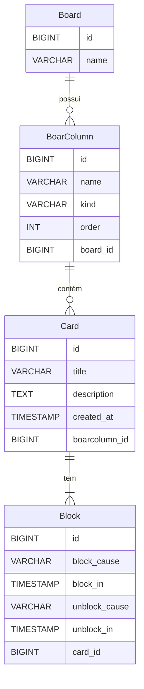

# TaskBoard

TaskBoard é uma aplicação de gerenciamento de tarefas baseada em Java, com integração ao banco de dados PostgreSQL e Liquibase para gerenciamento de migrações. O objetivo da aplicação é fornecer uma estrutura para criar, gerenciar e organizar tarefas em um board.

---

## Funcionalidades

- **Criação de Boards**: Organize suas tarefas em diferentes boards.
- **Colunas**: Adicione colunas personalizadas ao seu board (To Do, Doing, Done, etc.).
- **Cartões (Cards)**: Adicione tarefas detalhadas em cada coluna.
- **Bloqueios (Blocks)**: Registre e gerencie motivos de bloqueio de tarefas.

---

## Pré-requisitos

Antes de começar, certifique-se de ter os seguintes softwares instalados no seu sistema:

- **Java** (versão 8 ou superior)
- **Gradle** (gerenciador de build)
- **PostgreSQL** (base de dados)
- **Liquibase** (para migrações de banco de dados)

---

## Configuração do Projeto

1. Clone o repositório do projeto:

   ```bash
   git clone <URL_DO_REPOSITORIO>
   cd TaskBoard
   ```

## Diagrama de Entidade-Relacionamento


